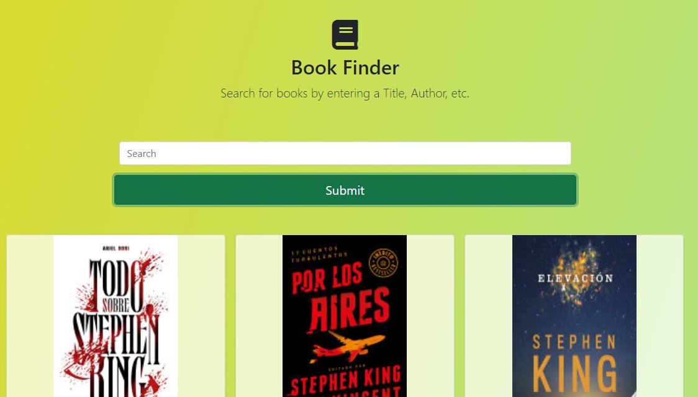

# Book finder app build with JavaScript

# Live demo

> https://elegant-snyder-b68cc7.netlify.app



## Table of contents

- [General info](#general-info)
- [Code Examples](#code-examples)
- [Features](#features)
- [Contact](#contact)

## General info

Project idea from freecodecamp:

https://www.freecodecamp.org/news/here-are-some-app-ideas-you-can-build-to-level-up-your-coding-skills-39618291f672/

- Responsive, build with Bootstrap.

## Code Examples

./js/script.js

```
function displayData(data) {
  if (!data.items) return displayError('No results found.');

  const booksContainer = document.querySelector('.books-container');

  spinner('hide');

  booksContainer.innerHTML = '';

  data.items.forEach((el) => {
    booksContainer.innerHTML += `
    <div class="col">
    <div class="card shadow-sm">
        </img>

      <div class="card-body">
        <p class="card-text">${formatText(el.volumeInfo.description)}</p>
        <div class="d-flex justify-content-between align-items-center">
          <div class="btn-group">
            <a class="btn btn-sm btn-outline-secondary" href="${
              el.volumeInfo.infoLink
            }" target="_blank" role="button">View More</a>
          </div>
          <small class="text-muted">Published: ${
            el.volumeInfo.publishedDate
          }</small>
        </div>
      </div>
    </div>
  </div>
  `;
  });
}
```

## Features

You can:

- Search a book for Title or Author

## Technology used

The project is created with:

- JavaScript

## Contact

Coded by Cudi - feel free to contact me!
